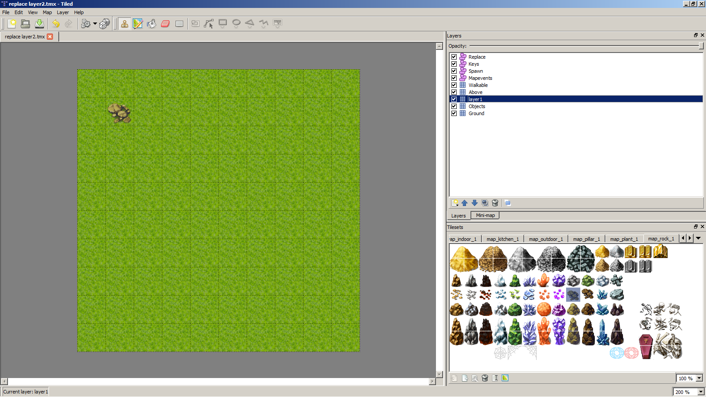
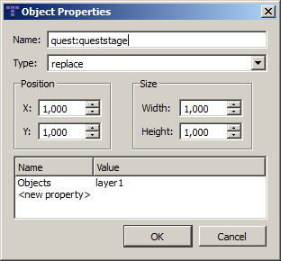
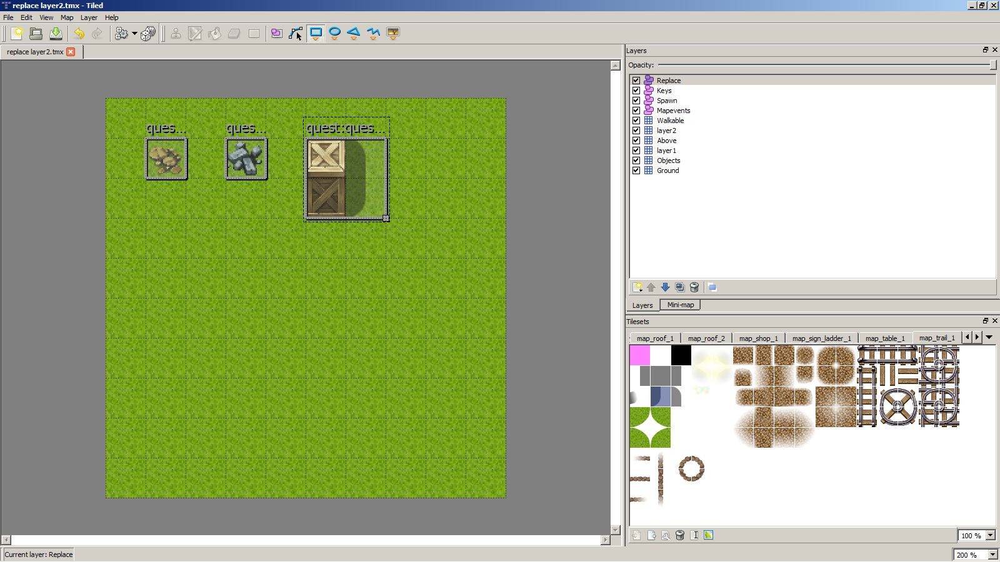
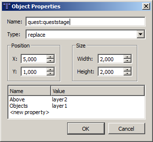

# Map Editor

Andor's Trail uses [Tiled](https://mapeditor.org) as map editor.

The map editor produces files with extension “.tmx”, that are XML files containing one map each. These files are loaded directly into the game. That's part of what's happening when the loading screen is visible.

To edit the maps used in Andor's Trail, open the TMX files from “res/xml” in the source code distribution directly into Tiled. They should load the tilesets correctly if you have the paths the same way as in the Git repository.

Additionally, see the [Map Guidelines](./) for making new maps.

Also, see the [Mapmaking Tutorial](map-making/) and the [Advanced Mapmaking Tutorial](map-making/advanced-map-making-tutorial.md) for a guide with screenshots on how to make maps for Andor's Trail.

## Layers

Tiled uses a concept of layers to place image tiles on top of other image tiles. The drawing process in Andor's Trail is roughly as follows:

1. Draw the “Ground” layer.
2. Draw the “Objects” layer.
3. Draw the player and monsters.
4. Draw the “Above” layer.

This way, you can for example choose to place a rock in the Object layer above a grass tile in the Ground layer. The Above layer is used for tiles which should lie over the player \(e.g. treetops or shadows\).

Please keep in mind that all objects placed on the map cause the rendering to be slowed down somewhat.

Maps in Andor's Trail also use another special layer called the “walkable” layer. Any tiles are filled \(with any image\) in this layer will be non-walkable. Currently, a transparent purple image is used as marker on this layer in the maps that are distributed.

## Object Layers

TMX files from Tiled also has a concept of “object layers”. Object layers can be mostly anything you want them to be, it's up to the implementation to decide what to do with them.  
Each object in an object layer has a name, type, and properties. The properties are key/value pairs.

Remember to enable snap to grid in menu/view in Tiled to make the selection box have the exact size as the tiles!

Andor's Trail uses the following object layers types:

### Spawn layer

### **Spawn object type**

Spawn areas are used for indicating where there should be monsters.

|  | Description |
| :--- | :--- |
| name |  The name of the selection box is the _spawngroup_ of the npc or monster that should spawn here. The monster spawn-groups can be edited with this [ATCS](../../contributor-section/atcs.md). |
| type | The type is called 'spawn'. |

Other properties that are possible to set on objects of this type are:

| Property Name | Type | Description |
| :--- | :--- | :--- |
| quantity | int | How many monsters should spawn in this area \(default is 1 if not supplied\) |
| active | bool | 'false' if the spawn area should not contain any monsters when starting a new game. Areas like this will typically be activated by some script or conversation. |

## Mapevents

### **Mapchange object type**

Mapchange areas are used for transitions to another map. The mapchange object actually serves two purposes:

* Determines in what map the player should end up on when walking onto one of these tiles.
* Gives a name on “this” map that other maps can refer to, when the player wants to return to “this” map.

|  | Description |
| :--- | :--- |
| name | The name of the selection box is most commonly a cardinal point. It is used as id to connect a map with another map. |
| type | The type is called 'mapchange'. |

If the following properties are set, the player will change map when stepping onto an object of this type:

| **Property name** | **Type** | **Description** |
| :--- | :--- | :--- |
| map | string | Name of the destination map where the player should transition to. |
| place | string | Name of the destination map change area on the other map where the player should transition to \(most commonly the **opposite** cardinal point of the current name: e.g.: north≠south\). |
| active | bool | “false” if the mapchange area should be disabled \(not having any effect\) when starting a new game. Areas like this will typically be activated by some script or conversation. |

### **Sign object type**

Sign object areas are used for giving the player a popup dialog box with a custom message when he steps on the area.

|  | Description |
| :--- | :--- |
| name | The name of the selection box is the phrase id which can be edited with [ATCS](../../contributor-section/atcs.md). |
| type | The type is called “sign”. |

### **Container object type**

Container object areas are used for making the selected area “lootable”, hence giving the player a popup dialogue box containing dropped items.

|  | Description |
| :--- | :--- |
| name | The name of the selection box is the droplist internal id which can be edited with [ATCS](../../contributor-section/atcs.md). |
| type | The type is called “container”. |

### **Rest object type**

Rest object areas are used for making the player “sleep” and recover all health points once he steps on the object area. Only the bottom tile of the bed contains such a “rest” area.

|  | Description |
| :--- | :--- |
| name | The name of the selection box is a custom name \(most commonly: rest or rest1, rest2 etc. if there are multiple beds in the same map\). |
| type | The type is called “rest”. |

### **Script object type**

A script object area basically triggers a dialogue hidden to the player that can be used for activating a trap, changing a map without displaying a quest in the quest log etc. The script areas only run when the player stands inside the script area's rectangular area. 

|  | Description |
| :--- | :--- |
| name | The name of the selection box is the phrase id which can be edited with [ATCS](../../contributor-section/atcs.md). |
| type | The type is called “script”. |

The following properties set:

| **Property name** | **Type** | **Description** |
| :--- | :--- | :--- |
| when | string | There are four possible values: enter, round, step and always. “enter” only activates the “script” area upon entering. “round” activates the “script” area every six seconds. “step” activates the “script” area upon every tile step. “always” activates the “script” area every 500 milliseconds.  |

A dialogue phrase can either give a reward or lead to a reply \(with requirements\).

* A reward can be a quest progress, a drop, a skill increase, an actor condition or an alignment/ faction change.
* A reply can lead to another phrase, a trading screen, a combat,the conversation ends or a npc is removed from the map.
* A requirement can be a quest progress, an item from the inventory will be removed, an item in the inventory, a worn item, a skill level or a killed monster.

## Key layer

### **Key object type**

Key object areas are used for restricting the player's movement unless the player meets a specific requirement. The player cannot move into a keyarea unless the player has fulfilled the things specified by the keyarea.

Requirements \(keys, quest stages\) are, for example, given by quests, and not really visible to the player.

If the player does not meet the required requirements, a conversation box will be shown to the player, starting at the phraseid specified by the “phrase” property.

|  | Description |
| :--- | :--- |
| name | The name of the selection box is not really used for anything at the moment. |
| type | The type is called “key”. |

| **Property name** | **Type** | **Description** |
| :--- | :--- | :--- |
| phrase | string | The internal id of the phrase that is displayed to the player if the requirement is not met. |
| requireType | string | Which type of requirement should be met for the player to be able to enter this key area.\\Valid values for requirements are, for example: \* “questProgress” - requires that the player has progressed to a certain point in some quest \* “wear” - requires that the player is wearing a certain item type \* “inventoryKeep” - requires that the player has a certain item type in inventory |
| requireId | string | The internal id of the quest or item id that the requirement should apply to. For example, for requireType=“questProgress”, this property should contain the quest id. |
| requireValue | int | How much of the “requireId” is required. For example, for requireType=“questProgress”, this property should contain the quest progress stage that must be reached. For “inventoryKeep”, this property should contain how many items are required \(defaults to 1 if not specified\). |

## Replace layer

### **Replace object type**

The replace area is a property of the “Replace” layer which is used for changing the look of the map when reaching a certain queststage.

Up to now, the “Replace” layer can only change tile layers \(Ground, Objects, Above and Walkable\) but no object layers \(Mapevents, Spawn, Key and Replace\).  
To change any tile layer, you have to create one new layer for every single layer you want to replace with other tiles and give it a custom name. The new layer should be always on top of the layer you want to modify. You can raise or lower the layers by right clicking the layer window. Only redraw the tiles in the selection box and leave the rest of the layer blank.  
To delete several layers, you can create one new layer for all these layers and leave it blank.

|  | Description |
| :--- | :--- |
| name | The name of the selection box is the internal id of the quest and the queststage which can be edited with this page: [Content Editor](http://andors-trail.googlecode.com/git/AndorsTrailEdit/editor.html#/monster/)/Quests. An example for a name is: testquest:20. |
| type | The type is called “replace”. |

The following properties can be set:

| **Property name** | **Type** | **Description** |
| :--- | :--- | :--- |
| tile\_layer\_id | string | The tile layer you want to change is supplied in the first board and the changed layer is in the second one. |

This small tutorial shows four examples of how to use the “Replace” layer:

1. Let's simply add a stone to the map. I have to duplicate the “Objects” layer because a stone is a semi-transparent tile. I called it “layer1”. Select the new layer and draw a stone. Now, I draw a rectangle over it with “Replace”. I edited the properties.

I added a new stone in “Objects” which I want to delete. I can reuse the layer1 because it's blank at that place and I used th same properties.

Now, I want to place an old chest and its shadow. I place the chest in layer1 and I added a new layer called layer2 because the shadow should be over the player and not under him.

The last small tutorial shows how to delete multiple things cleverly with only one layer. I drew a bush and made it unwalkable. Afterwards I used layer1 which is blank at this tile to delete both layers.

## Tilesets

The current tileset that is used is a modified version of [this](http://telles0808.deviantart.com/art/RPG-Maker-VX-RTP-Tileset-159218223) and additional images. This large image is spit up into several smaller parts \(to speed up the loading process\), which you can find in the “res/drawable” directory of the source code.

